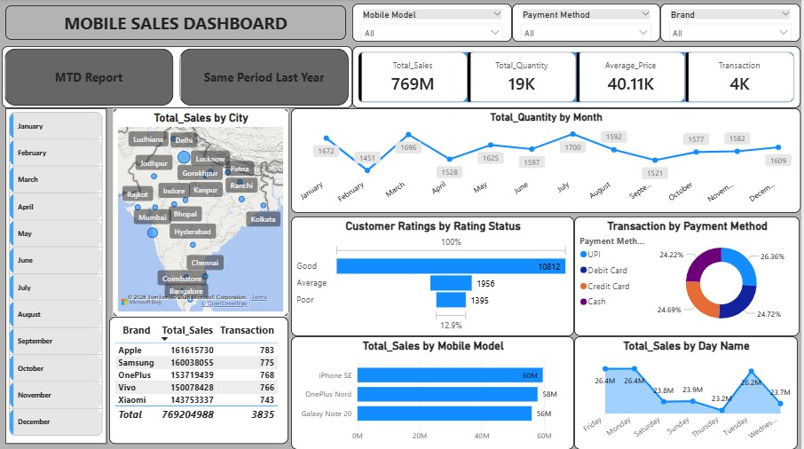

# Mobile Sales Analysis Dashboard – Power BI

This project presents an interactive **Mobile Sales Analysis Dashboard** built using **Microsoft Power BI**.
The dashboard analyzes mobile sales performance using key metrics such as **MTD (Month-to-Date) Sales** and **Same Period Last Year (SPLY)** comparisons.

---

## Project Overview

The objective of this project is to provide clear insights into mobile sales performance and compare current sales trends with historical data.

The dashboard helps to:

* Track mobile sales performance
* Compare **Month-to-Date (MTD)** sales
* Analyze **Same Period Last Year (SPLY)** trends
* Identify top-selling brands and models
* Support data-driven business decisions

---

## Key Metrics

* Total Sales
* Month-to-Date (MTD) Sales
* Same Period Last Year (SPLY)
* Sales Growth Comparison
* Brand-wise Sales Performance
* Product Category Analysis

---

## Tools Used

* Microsoft Power BI
* Data Visualization
* Business Intelligence

---

## Dashboard Preview

---

## How to Use

1. Download the `.pbix` file from the repository
2. Open the file using **Microsoft Power BI Desktop**
3. Explore the interactive mobile sales analysis dashboard

---

## Author

**Biki Haldar**

GitHub:
https://github.com/biki886
